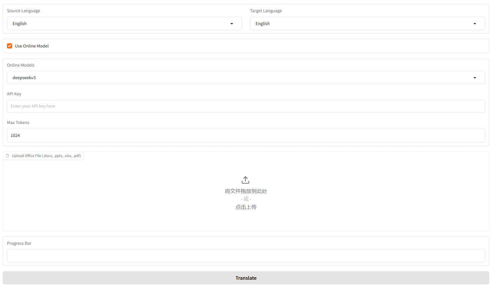

# AI-Office-Translator
[简体中文](README_ZH.md)  
[日本語](README_JP.md)  

**UI based on PyQt-Fluent-Widgets developing...**  
**Over 100 files have been tested**  
**If you find this project useful, please give it a star ^ ^_**  

## What's this
This software is a **Free**, **Fully Localized**, **User-friendly** translation tool that helps you translate Office files (Word, PowerPoint, and Excel) between different languages.  
Here's what it offers:  
  
- Supported File Types: Accepts .docx, .pptx, and .xlsx files.
- Language Options: You can translate between English, Chinese, and Japanese. 

## Get Started
### CUDA
You need to install CUDA
(Currently there are no problems with 11.7 and 12.1 tests)  

### Ollama
You need to download Ollama dependencies and models for translation
- Download Ollama  
https://ollama.com/  

- Download model (QWen series models are recommended) 
```bash
ollama pull qwen2.5
```
### Virtual Environment (Optional)
Create and start a virtual environment
```bash
conda create -n ai-translator python=3.10
conda activate ai-translator
```
### Requirements
Install requirements
```bash
pip install -r requirements.txt
```
### Run This Tool
Run the tool
```bash
python app.py
```

## APP
### Instructions

- Select Language  
Select the source language (the language of the source file) and the target language (the language you want to translate into).  
- Select Model  
In Model, you can select the model downloaded by ollama. It is not recommended to modify Max_tokens (unless you understand LLM well enough).  
- Upload File  
Click Upload Office Flie/drag the file to this location to upload the file need to be translated.  
The program will automatically determine the file type to be translated.  
- Start Translate   
Click Translate and the program will start translating.  
- Download Translated File  
When the translation is completed, the translated file will be returned at Download Translated File.  
You can also view the translation results in the ~/result folder.  

Added Online mode, currently only supports Deepseek-v3 (Cheap and fast->0.1 CNY/million tokens)  
After selecting Online mode, you will need to enter API-KEY. Please refer to the official website for how to obtain it  
https://www.deepseek.com/

After the translation is completed, a download box will pop up.

### Example 
- Excel File: English to Japanese  
  
- PPT File: English to Japanese  
  
- Word File: English to Japanese  

- PDF File: English to Japanese  


The default access address is
```bash
http://127.0.0.1:9980
```
If you need to share in the LAN, please open the last line
```bash
iface.launch(share=True)
```

## Referenced Projects
- [ollama-python](https://github.com/ollama/ollama-python)
- [PDFMathTranslate](https://github.com/Byaidu/PDFMathTranslate)

## To be updated
- Support more models and more file types

## Software Disclaimer  
The software code is completely open-source and can be freely used in accordance with the GPL-3.0 license.  
The software only provides AI translation services, and any content translated using this software is unrelated to its creators.  
Users are expected to comply with the law and engage in legal translation activities. 

Qwen Model Disclaimer  
The code and model weights are fully open for academic research and support commercial use.  
Please refer to the Qwen LICENSE for detailed information on the specific open-source agreement. 

## Changelog
- 2025/01/15  
Fixed a bug in PDF translation, added multi-language support, and petted a kitty.
- 2025/01/11  
Add support for PDF。Referenced Projects：[PDFMathTranslate](https://github.com/Byaidu/PDFMathTranslate)
- 2025/01/10    
Add support for deepseek-v3. Now you can use the api for translation. (more stable)  
API GET: https://www.deepseek.com/
- 2025/01/03  
Happy New Year! The logic has been revised, a review feature has been added, and logging has been enhanced.
- 2024/12/16  
Update Error detection and Re-translation
- 2024/12/15  
Added some validations and fixed the bug of getting context function
- 2024/12/12  
Updated the handling of line breaks. Fixed some bugs