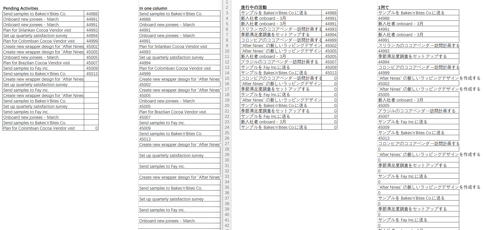
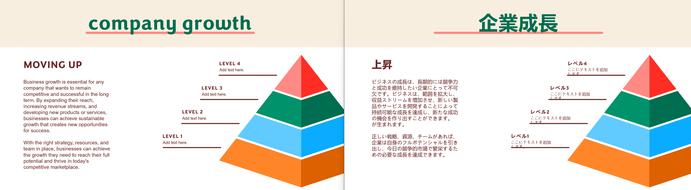
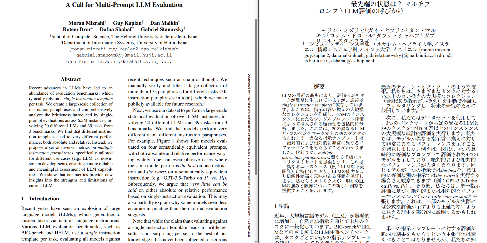

<div align="center">
<h1 id="title">LinguaHaru</h1>

[English](README.md) | [简体中文](README_ZH.md) | 日本語


<div align=center>      </div>
<p align='center'>ワンクリック翻訳に対応した使いやすいAI翻訳ツールで、複数の文書形式と言語をサポートしています。</p>

</div>
<h2 id="What's This">これは何ですか？</h2>
このソフトウェアは、様々な文書形式と複数の言語をサポートする無料で使いやすいAI翻訳ツールです。

主な特徴：

- ワンクリック翻訳：シンプルな操作で文書を簡単に翻訳できます。
- サポートするファイル形式：.docx、.pptx、.xlsx、.pdf、.txt、.srtファイルに対応し、将来的にはさらに多くの形式をサポート予定です。
- 言語オプション：10以上の言語間の翻訳をサポートし、さらに拡大する計画があります。
- 柔軟な翻訳モデル：ローカルモデルとオンラインAPIベースの翻訳の両方をサポートします。
- ローカルネットワーク共有：ローカルネットワーク内で翻訳機能を共有できます。


<h2 id="install">インストールと使用方法</h2>

1. [CUDA](https://developer.nvidia.com/cuda-downloads)   
CUDAをインストールする必要があります（現在、11.7と12.1のテストで問題は確認されていません）  

2. Python (python==3.10)  
    [Conda](https://www.anaconda.com/download)を使用して仮想環境を作成することをお勧めします  
    ```bash
    conda create -n lingua-haru python=3.10
    conda activate lingua-haru
    ```

3. 必要なパッケージのインストール
    - 要件
        ```bash
        pip install -r requirements.txt
        ```
    - モデルのダウンロード
        ダウンロード後は「models」フォルダに保存してください**  
        - [Baidu Netdisk](https://pan.baidu.com/s/1erFEqR4CgR0JwWvpvms4eQ?pwd=v813)
        - [Google Drive](https://drive.google.com/file/d/1UVfJhpxWywBu250Xt-TDkvN5Jjjj0LN7/view?usp=sharing)


4. ツールの実行
    ```bash
    python app.py
    ```
    デフォルトのアクセスアドレスは
    ```bash
    http://127.0.0.1:9980
    ```

5. ローカル大規模言語モデルのサポート  
    現在は[Ollama](https://ollama.com/)のみサポートしています  
    翻訳にはOllamaの依存関係とモデルをダウンロードする必要があります
    - モデルのダウンロード（QWenシリーズのモデルを推奨）
        ```bash
        ollama pull qwen2.5
        ```

<h2 id="preview">プレビュー</h2>
<div align="center">
  <h3>Excel</h3>
  
  <h3>スライド</h3>
  
  <h3>PDF</h3>
  
</div>


## 参照プロジェクト
- [ollama-python](https://github.com/ollama/ollama-python)
- [PDFMathTranslate](https://github.com/Byaidu/PDFMathTranslate)

## 今後の予定
- 翻訳継続機能の追加。
- Excelファイルの翻訳速度の最適化。

## 変更履歴
- 2025/02/01  
翻訳失敗テキストの処理ロジックを更新。
- 2025/01/15  
PDF翻訳のバグを修正し、多言語サポートを追加し、子猫を撫でました。
- 2025/01/11  
PDFのサポートを追加。参照プロジェクト：[PDFMathTranslate](https://github.com/Byaidu/PDFMathTranslate)
- 2025/01/10    
deepseek-v3のサポートを追加。APIを使用して翻訳できるようになりました（より安定しています）。  
API取得先: https://www.deepseek.com/
- 2025/01/03  
新年おめでとうございます！ロジックを改訂し、レビュー機能を追加し、ロギングを強化しました。
- 2024/12/16  
エラー検出と再翻訳機能を更新
- 2024/12/15  
いくつかの検証を追加し、コンテキスト取得機能のバグを修正
- 2024/12/12  
改行の処理を更新。いくつかのバグを修正

## ソフトウェア免責事項  
このソフトウェアコードは完全にオープンソースであり、GPL-3.0ライセンスに従って自由に使用できます。  
このソフトウェアはAI翻訳サービスのみを提供し、このソフトウェアを使用して翻訳されたコンテンツは、その作成者とは無関係です。  
ユーザーは法律を遵守し、合法的な翻訳活動に従事することが期待されています。

Qwenモデル免責事項  
コードとモデルの重みは、学術研究のために完全に公開されており、商業利用もサポートしています。  
特定のオープンソース契約に関する詳細情報については、Qwen LICENSEを参照してください。