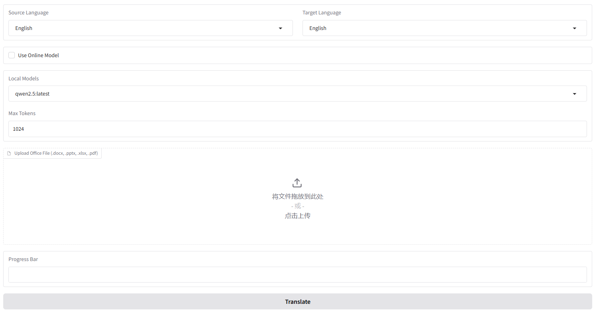
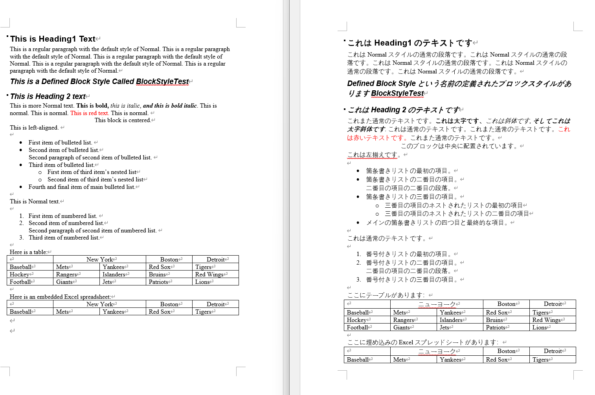

# AI-Office-Translator

**基于PyQt-Fluent-Widgets的UI开发中...**  
**已测试超过100份文件**  
**如果觉得本项目对你有用，欢迎点一个Star ^ ^_**

## What's this
这是一款**免费**、**完全本地化**、**用户友好**的翻译工具，能够帮助您在不同语言之间翻译 Office 文件（Word、PowerPoint 和 Excel）。
功能特点如下：
  
- 支持文件类型：支持 .docx、.pptx 和 .xlsx 文件。
- 语言选项：可以在 英语、中文 和 日语之间进行翻译。（更多语言支持即将更新……）

## 快速上手
### CUDA
您需要安装 CUDA
（目前测试 11.7 和 12.1 版本没有问题）

### Ollama
您需要下载 Ollama 依赖以及用于翻译的模型
- Download Ollama  
https://ollama.com/  

- 下载模型（推荐 QWen 系列模型）
```bash
ollama pull qwen2.5
```
### 虚拟环境（可选）
创建并启动虚拟环境
```bash
conda create -n ai-translator python=3.10
conda activate ai-translator
```
### 安装依赖
安装必要依赖
```bash
pip install -r requirements.txt
```
### 启动工具
运行工具
```bash
python app.py
```

## APP
### 使用说明


使用示例可见Bilibili：  
https://www.bilibili.com/video/BV12zByYzECQ/?share_source=copy_web&vd_source=93b449eba1686337d8198856a26fe2f9  

- 选择语言  
选择源语言（源文件的语言）和目标语言（要翻译成的语言）。  
- 选择模型  
在 Model 栏中选择通过 Ollama 下载的模型。建议不要修改 Max_tokens 设置（除非您对 LLM 有足够的了解）。  
- 上传文件
点击 Upload Office File 或拖动文件到指定区域上传需要翻译的文件，程序会自动识别文件类型。  
- 开始翻译  
点击 Translate 按钮，程序将开始翻译。  
- 下载文件  
翻译完成后，您可以在 Download Translated File 处下载翻译后的文件。翻译结果也会保存在 ~/result 文件夹中。  

### 示例
- Excel 文件: 英文到日文  
  
- PPT 文件: 英文到日文  
  
- Word 文件: 英文到日文  

默认访问地址为：
```bash
http://127.0.0.1:9980
```
如果需要在局域网中共享，请修改最后一行：
```bash
iface.launch(share=True)
```

## 参考项目
- [ollama-python](https://github.com/ollama/ollama-python)

## 待更新
- Support more models and more file types
- More Language support

## 软件声明
软件代码完全开源，可以随意取用，请遵守GPL-3.0 license，软件只提供AI翻译服务，所有由本软件制成的翻译内容，与制作人无关，请各位遵守法律，合法翻译。  
Qwen模型相关声明  
代码和模型权重对学术研究完全开放，并支持商用。请查看通义千问LICENSE了解具体的开源协议细节。

## 更新日志
- 2025/01/10  
增加对Deepseek-v3的支持。（建议电脑不好的兄弟们使用这个，真的是国产之光良心模型）。相对于本地模型翻译质量更高。  
API获取: https://www.deepseek.com/
- 2025/01/03  
新年快乐！重新修改了逻辑，增加了复查功能，增加了log。
- 2024/12/16  
更新了错误检测和重新翻译
- 2024/12/15  
增加了一些验证，修正了获取上下文功能的BUG
- 2024/12/12  
更新了换行符处理，修正了一些错误